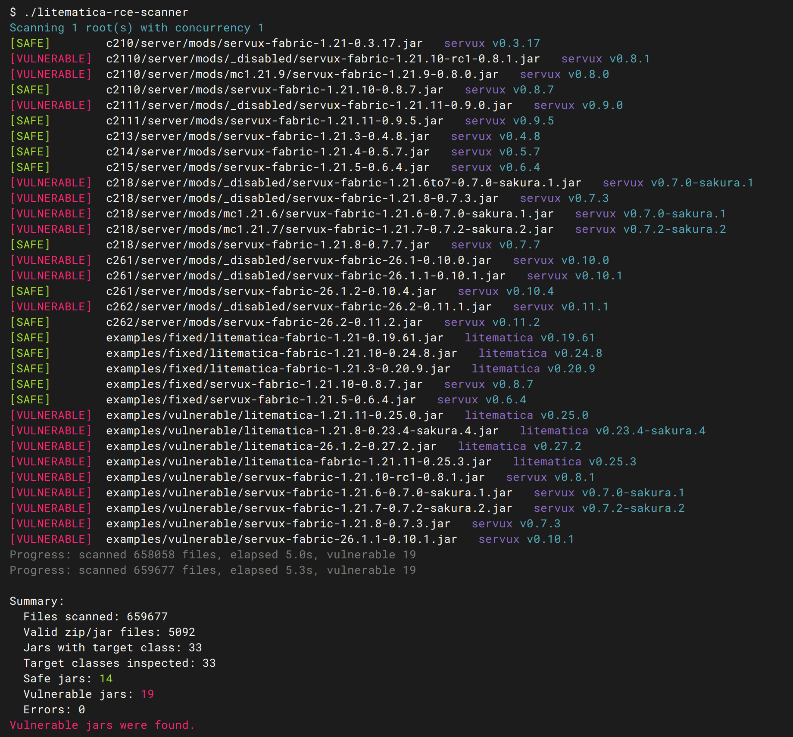

# litematica-rce-scanner

[](http://www.gnu.org/licenses/gpl-3.0.html)
[](https://github.com/Fallen-Breath/litematica-rce-scanner/issues)
[](https://hub.docker.com/r/fallenbreath/litematica-rce-scanner)

English | [中文](README_zh.md)

A lightweight command-line scanner that detects vulnerable [Litematica](https://github.com/sakura-ryoko/litematica) and [Servux](https://github.com/sakura-ryoko/servux) jar files.

It scans one or more specified paths, identifies Litematica/Servux jars, and flags vulnerable versions so you can remove or upgrade them promptly.



## Usage

```bash
litematica-rce-scanner [options] [path ...]
```

If no path is given, the scanner defaults to the current directory.

Common options:

```text
-j, -concurrency int      number of files to scan concurrently (default 1)
-csv path                 write detected Litematica/Servux jar results to a CSV file
-color value              color output mode: auto, always, never (default auto)
-progress                 print periodic progress to stdout (default true)
-warnings                 print per-file warnings for scan failures (default false)
-non-recursive            scan only immediate files under each directory, do not recurse into subdirectories
-fail-on-vulnerable       exit with code 1 if any vulnerable jar is found
-version                  print version information and exit
```

Set `-progress=false` to suppress progress output.  
Set `-non-recursive` to restrict scanning to files directly inside each specified directory. If a positional argument is a file path, it will be scanned directly.  
Set `-warnings` to enable per-file warnings such as permission-denied errors. When this flag is omitted, warnings are still aggregated in the final summary but not printed individually.

Examples:

```bash
./litematica-rce-scanner
./litematica-rce-scanner -j 8 /path/to/mods /another/path
./litematica-rce-scanner -non-recursive ./mods
./litematica-rce-scanner ./mods/litematica.jar
./litematica-rce-scanner -warnings /
./litematica-rce-scanner -csv results.csv -fail-on-vulnerable ./mods
```

On Windows, you can drag one or more folders onto the `.exe` file to launch it. When run in an interactive Windows console without explicit command-line flags, the program will pause and wait for Enter before exiting, preventing the console window from closing immediately. Use `-no-pause` to disable this behavior.

## Output

Terminal output is in English. ANSI color is enabled by default in interactive terminals, including modern Windows terminals.

At startup, the scanner prints the number of scan roots and the configured concurrency. Before each root is traversed, it also prints the root path being scanned.

During scanning, progress is printed to stdout every 5 seconds, with the first update appearing approximately 5 seconds after startup. A final progress line is shown after scanning completes:

```text
Progress: scanned 123 files, elapsed 12.3s, vulnerable 7
```

The scanner does not pre-traverse the entire directory tree or keep all paths in memory; instead, it walks and scans concurrently using a small bounded work queue, keeping resource usage low.

Detected Litematica and Servux jars are reported in real time as they are scanned. Vulnerable jars are marked `[VULNERABLE]`, while jars that match the target class but do not satisfy the vulnerable constructor rule are marked `[SAFE]`.

```text
[VULNERABLE]  path/to/file.jar   litematica v1.2.3
[SAFE]        path/to/file.jar   servux
```

The `version` field is extracted from `fabric.mod.json` when available. If the manifest or version information cannot be read, the field is omitted.

If vulnerable jars are found, the final summary asks you to update the affected mods as soon as possible and prints Modrinth version pages for Litematica and Servux.

When CSV output is enabled, the file contains the following columns:

```text
path,mod,status,version
```

Only detected Litematica or Servux jars are written to the CSV.

## Detection Details

The scanner walks through regular files under the specified paths. Directory scanning is recursive by default; using `-non-recursive` limits it to immediate files within each target directory. The scan does not depend on file extensions.

A file is considered a candidate only if it is a valid ZIP/JAR archive and its ZIP central directory contains exactly one of the following class entries:

- `fi/dy/masa/litematica/schematic/transmit/SchematicBuffer.class`
- `fi/dy/masa/servux/schematic/transmit/SchematicBuffer.class`

The scanner first verifies the minimum ZIP size and the local file header magic, then reads the ZIP end record and central directory using Go's `archive/zip` package. It does not decompress entire archives. For matching jars, only the target `SchematicBuffer.class` file is extracted.

A jar is reported as vulnerable if every constructor in the target `SchematicBuffer.class` has `java.lang.String` as its first parameter. The class parser inspects the method table directly using these rules:

- method name must be `<init>`
- the method descriptor must include a first parameter
- that first parameter must be `Ljava/lang/String;`
- only when all constructors satisfy these conditions is the jar marked as vulnerable

If the target class cannot be read or parsed, it is counted as an error rather than being reported as vulnerable. Use `-warnings` to print detailed per-file error information.

## Docker

The scanner can also be run as a container. Images are available on both Docker Hub and GHCR.

The following commands scan all files under the current directory recursively, using default single-threaded settings:

```bash
docker run --rm -t -v "$PWD:/scan:ro" fallenbreath/litematica-rce-scanner:latest
docker run --rm -t -v "$PWD:/scan:ro" ghcr.io/fallen-breath/litematica-rce-scanner:latest
```

The container runs as root by default, which is helpful for scanning mounted local files that have restrictive ownership or permission settings.
